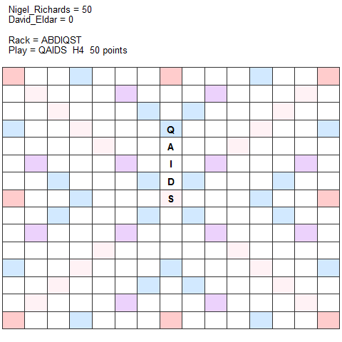

The `quacklr` R package contains a suite of functions for extracting scrabble data generated by the scrabble software package [Quackle](http://people.csail.mit.edu/jasonkb/quackle/) into tidy data formats. The package is also able to interface with annotated games stored on the website [cross-tables](http://www.cross-tables.com/) to convert these into tidy data.

A quick note is that this package is in development.  I have created it to retrieve data for games and tournaments using the CSW15 word source. I haven't checked it yet for other lexica, but it should work. If not, please file a GitHub issue.

## Main Functions

The main function of the package is `game()`. This will create the tidy data frame of a quackle analyzed game file.  The game file can be either be saved on a drive or hosted on [cross-tables](http://www.cross-tables.com/). First, we need to get the raw untidy data. To do that, provide either the number of the annotated game on x-tables or a link to the annotated game (either any move during the game, or the actual .gcg file link at the bottom of the page).  The raw untidy data is acquired using the `game_file()` function like this:

```{r}
library(quacklr)
x1 <- game_file(28283)
x2 <- game_file("http://www.cross-tables.com/annotated/selfgcg/281/anno28152.gcg")
x3 <- game_file("http://www.cross-tables.com/annotated.php?u=28190#0#")

```

Game `x1` is a game between Jesse Day and Will Anderson - round 1 of the Poughkeepsie NY tournament on the 10th March 2018.

Game `x2` is a game between Jesse Day and Dave Koenig - round 5 of the Manhattan NY tournament on the 24th February 2018.

Game `x3` is a game between Ben Schoenbrun and Chris Lipe - round 9 of the Hood River OR tournament on the 17th February 2018.

\  

After retrieving the raw data, we can create the tidy data frames like this:

```{r}
x1g <- game(x1)
x2g <- game(x2)
x3g <- game(x3)
```

This is what the tidy data looks like for game `x3`:
\  


```{r, echo=FALSE}
DT::datatable(x3g)
```


\  

\  


We can also get some summary statistics for each game using the `game_summary()` function:

\  

```{r}
x3gs <- game_summary(x3g)
```


```{r, echo=FALSE}
knitr::kable(x3gs)
```


\  

This records the points scored by each player, the number of turns they took and their average points per turn.  We can also see how many tiles they put onto the board and how many of these were power tiles (The power tiles are ZQJXSSSS?? where ? = blank).  Other pieces of information are how many times and tiles they exchange, whether they had a phony challenged off. We can also see the number of turns they played vertically or horizontally, how many times they played through disconnected letters (i.e. a word through a tile already on the board rather than just a parallel play). If a play is played up to but not through a letter already on the board then it is classed as 'joined'. You can also see what letters were designated for each blank play.


Another summary function is `tile_dist()`. This allows us to see what the distribution of tiles played was in a game:

\  
```{r}
tile_dist(x3g)
```

\  


## Words played

It's possible to examine the words played directly from the tidy data frame produced from the `game()` function.  However, there are two helper functions for doing this more quickly.

Firstly, to get all the words laid down on the board by players in a game use `game_words()`:

```{r}
game_words(x3g)
```

This function also represents blanks in words as lower case letters.

\  

Alternatively, to get all the words that appear on the board at the end of a game (including words created via parallel plays), use the `game_all_words()` function:

```{r}
game_all_words(x3g)
```

\  


## Making board diagrams

To recreate the final board of any game, simply use the `game_board()` function with any tidy data frame outputted from the `game()` function. The two best diagram type options are 'pretty' or 'dots'.

This is the final game board of the Day vs Anderson game using `type="pretty"` which is the default: 

```{r}
game_board(x1g)
```

\  

This is the final game board of the Schoenbrun vs Lipe game using `type="dots"`: 

```{r}
game_board(x3g, type="dots")
```


\  

\  

## ggplot based scrabble board

Included is an option for examining scrabble boards using a `ggplot2` formatted plot. To create a `ggplot2` plot use the function `game_board_geom()` like this:


```{r, fig.cap = "Day vs Anderson, Poughkeepsie NY 3/10/2018", fig.height=4, fig.width=4, warning=FALSE}
game_board_geom(x1g, fsize=4, asize=.8) 
```

```{r, fig.width=8,height=4}
p1<-game_board_geom(x1g, fsize=3, asize=.7, gsize=.5, alp=.2, facetype='plain') + labs(caption="Day vs Anderson \n Poughkeepsie NY 3/10/2018")

p2<-game_board_geom(x2g, fsize=3, asize=.7, gsize=.5,  alp=.2, facetype='plain') + labs(caption="Day vs Koenig \n Manhattan NY 2/24/2018")

p3<-game_board_geom(x3g, fsize=3, asize=.7, gsize=.5, alp=.2, facetype='plain') + labs(caption="Schoenbrun vs Lipe \n Hood River OR 2/17/2018")

library(patchwork)
p1 | p2 | p3
```

\  

## Iterating through a game

Any move of a game can be viewed in ggplot board format by using the `turn` parameter:

```{r}

```


## Making a gif of a game

Taking things a step further, it's possible to create gifs of games. Here I'm creating a gif of a game between Nigel Richards and David Eldar.  I don't think it's worth making this into a stand-alone function, but here's the code to do it using the `animation` library.


```{r, eval=FALSE}
x <- game(game_file(26927))

library(animation)
saveGIF({

  for (i in 1:nrow(x)){

    player1=x[1,1]
    player2=x[2,1]
    
  if(i==nrow(x)){
    p1or2 <-match(x[nrow(x),1], c(player1,player2))
      if(p1or2==1){
      score1 = x$total[i]
      score2 = x$total[i-2]
      } else
        if(p1or2==2){
          score2 = x$total[i]
          score1 = x$total[i-2]
        } 
          } else   
      
  if(i==1){
    score1 = x$total[i]
    score2 = 0
    } else   
  if(i %% 2 == 0){
    score1 = x$total[i-1]
    score2 = x$total[i] 
    } else
  if(i %% 2 == 1){
    score1 = x$total[i]  
    score2 = x$total[i-1] }
    
lastplay <- x$play[i]
position <- x$position[i]
pts <- x$score[i]
rack <- x$rack[i]

  a <-  game_board_geom(x, fsize=5, asize=.7, gsize=.7, alp=.2, turn=i)+
      theme_void()+
      ggtitle(paste0("   ",player1," = ",score1, "\n   ",player2," = ", score2,"\n \n   Rack = ",
                     rack,  "\n   Play = ", lastplay, "  ", position, "  ", pts,  " points"))
    
  print(a)}

}, interval = 1.5, movie.name="test.gif")

```




## For the future

If I feel inspired I may do more in the future. It would be interesting to compare statistics from games of top players, which is what I'll probably do.  Any questions or comments please get in touch [via twitter](www.twitter.com/jalapic).

\  

\  


